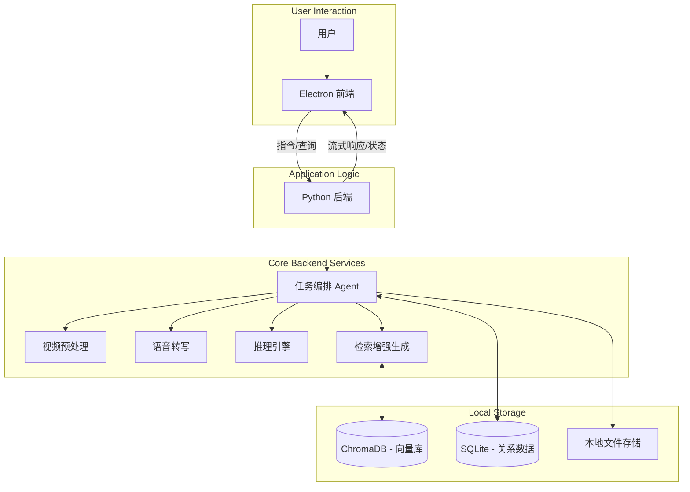

# 端侧长视频智能整理与摘要 Agent 架构设计文档

## 1. 项目概述

本项目旨在构建一个**运行在用户本地（端侧）**的智能 Agent，专注于长视频内容的自动整理、摘要生成及问答交互。主要解决用户阅读效率与视频信息获取速度不匹配的问题，同时严格保障用户数据的隐私与机密性。

### 核心价值

- **隐私优先**：所有数据处理（语音转写、摘要生成、向量存储）均在本地完成，无需上传云端。
- **高效摄入**：将线性流动的长视频转化为结构化的文本摘要、思维导图和可检索的知识库。
- **智能交互**：支持针对视频内容的自然语言问答（RAG），帮助用户快速定位关键信息。

---

## 2. 技术栈选型 (Technology Stack)

考虑到“端侧运行”对性能的敏感性以及“中文语境”的需求，我们进行如下选型：

### 2.1 核心大模型 (LLM & AI)

* **大语言模型 (LLM)**: `Qwen2.5-7B-Instruct` (4-bit 量化版)
  * *理由*：通义千问 2.5 在中文理解、指令遵循和长文本处理上表现优异，7B 参数量配合 4-bit 量化（约 4-6GB 显存/内存）适合主流消费级 PC 运行。
  * *推理引擎*: 优先 `Llama.cpp`（`llama-cpp-python` / `llama-server`），在 Windows/CPU/Nvidia/Apple Silicon 上兼容性最强；若明确限定为 Linux + Nvidia CUDA 环境，可选 `vLLM` 作为增强方案。
* **自动语音识别 (ASR)**: `Faster-Whisper` (Large-v3 模型)
  * *理由*：基于 CTranslate2 优化，比原始 Whisper 快 4-5 倍，显存占用更低，且对多语言支持极佳。
  * *落地建议*：默认提供 `small/medium` 作为 CPU 可用档位；`large-v3` 作为“高质量模式”（建议 GPU）以降低端侧等待时间。
* **向量模型 (Embedding)**: `BGE-M3` 或 `m3e-base`
  * *理由*：轻量级中文 Embedding 模型，支持长文本语义匹配。

### 2.2 应用程序框架

* **前端 (UI)**: `Electron` + `React` + `TailwindCSS`
  * *理由*：Electron 提供成熟的跨平台桌面能力；React 生态丰富，方便构建复杂的交互界面（如视频时间轴、聊天窗口）。
* **后端 (Core Logic)**: `Python` (`FastAPI`)
  * *理由*：AI 生态（PyTorch, HuggingFace）主要在 Python。Electron 用于界面展示，通过本地 HTTP 或 WebSocket 与 Python 后端通信。
* **数据库**:
  * **关系型数据**: `SQLite` (存储视频元数据、历史记录)。
  * **向量数据库**: `ChromaDB` (轻量级，文件存储，无需独立服务进程)。

### 2.3 端侧运行约束与推荐配置 (Runtime Profiles)

为保证“端侧可用”，建议在需求中明确最低/推荐配置，并在 UI 中暴露“性能档位”。

* **档位 A - CPU 友好（最低可用）**:

  * **ASR**: Faster-Whisper `small/medium`
  * **LLM**: 3B/7B 4-bit（偏短上下文）
  * **预期**: 可离线完成全流程，但长视频处理时间较长（更适合作为后台任务）。
* **档位 B - GPU 推荐（体验优先）**:

  * **ASR**: Faster-Whisper `large-v3`
  * **LLM**: 7B 4-bit（更长上下文、响应更快）
  * **预期**: 导入-摘要-问答的端到端等待时间显著缩短。
* **档位 C - 轻量独显（2GB 显存，如 MX570）**:

  * **定位**：兼顾“能跑得动”和“体验可接受”，但不以大模型全程 GPU 加速为目标。
  * **ASR**：优先 Faster-Whisper `small/medium`（若 CUDA 可用则启用 GPU；2GB 显存通常不建议 `large-v3`）。
  * **LLM**：默认使用 3B/4B 级别 4-bit（CPU 推理为主）；7B 4-bit 可作为可选项，但需要更长等待时间。
  * **并发策略**：同一时间只允许 1 个 ASR Job + 1 个 LLM Job，避免 16GB 内存/低压 U 系列 CPU 被打满导致系统卡顿。
* **默认策略（高性能模式，偏速度）**:

  * **默认档位**：以“档位 C”为默认基线（覆盖 16GB + 2GB 轻量独显场景）。
  * **默认 ASR**：优先 `small`（GPU 可用则启用 GPU），以缩短端到端处理时间；`medium` 作为可选项。
  * **默认 LLM**：默认 3B/4B 4-bit 以保证交互响应速度；提供“一键切换 7B 4-bit（质量优先）”。
  * **资源使用**：推理/转写允许使用更高线程数与更激进的 batch 参数（在不引发 OOM 的前提下），并在前端明确提示可能导致风扇噪音与更高功耗。

建议补充：

* **目标机型参考**：Intel i5-1235U / 16GB RAM / MX570 2GB VRAM 作为“推荐最低体验”基线，在此基线上保证：导入、转写、生成摘要、基于时间戳引用的问答可完整跑通。

---

## 3. 系统整体架构 (System Architecture)

采用 **B/S 变体架构** (Browser-Server inside Desktop App)：前端负责交互与展示，后端负责繁重的 AI 计算。

---

## 4. 后端逻辑架构 (Backend Logic)

后端设计为**流水线 (Pipeline) + 按需服务**模式。

### 4.1 数据处理流水线 (The Ingestion Pipeline)

当用户导入一个视频时，系统自动触发以下流程：

1. **预处理**: 使用 `FFmpeg` 提取音频轨道（转化为 16k wav）和关键帧图片（每隔 N 秒或是场景变换）。
2. **转写 (Transcribe)**: 调用 `Faster-Whisper` 将音频转为带时间戳的文本段落 (Segments)。
3. **清洗与分块**: 修正显而易见的转写错误（可选），根据语义或时间窗口将文本切分为 Chunk。
4. **向量化 (Embedding)**: 计算 Chunk 的向量并存入 `ChromaDB`，关联视频 ID 和时间戳。
5. **结构化摘要**:
   * 利用 LLM 对全文进行分段摘要（Map）。
   * 最后生成总摘要（Reduce）、思维导图节点、关键实体提取。

补充说明：

* **关键帧用途**: MVP 阶段关键帧主要用于 UI 展示（章节缩略图/时间轴定位）。若后续要做“基于画面内容的摘要/检索”，需额外引入视觉模型（VLM）并新增图像向量化与多模态检索链路。

### 4.2 交互逻辑 (Interaction Logic)

* **Chat Agent**: 用户的提问 -> Embedding -> 在 VectorDB 检索相关视频片段 -> 拼接 Prompt (包含上下文 + 系统提示词) -> LLM 生成回答。
* **跳转定位**: LLM 的回答应包含 `[Timestamp]` 引用，前端解析后允许用户点击跳转到视频对应位置。

### 4.3 任务队列

* 鉴于端侧算力有限，所有耗时任务（转写、Embedding、摘要生成）应放入后台队列，避免阻塞 API 响应，并通过 WebSocket 推送进度给前端。
* **桌面端落地建议**：避免引入 `Celery + Redis/RabbitMQ` 这类服务依赖，优先采用“本地 Job Runner”模型：
  * FastAPI 负责接收请求、读写 SQLite 状态；
  * 独立 Worker 进程（`multiprocessing` 或 `asyncio` + 线程池）轮询/订阅 Job 表并执行；
  * 应用启动时自动拉起 Worker；应用退出时优雅停止；
  * 支持 Job 取消/暂停/继续与并发度控制（例如同时只跑 1 个 ASR，避免把机器打满）。

### 4.4 断点续跑与缓存 (Resume & Cache)

* **断点续跑**：ASR 结果、Chunk、Embedding、摘要等中间产物都应落盘并与视频文件 hash 绑定；异常退出后可从最近阶段恢复。
* **去重与缓存**：同一视频重复导入时直接复用结果；同一段文本的 Embedding 可按内容 hash 缓存。
* **可观测性**：为每个 Job 记录耗时、模型版本、参数（chunk size、overlap 等），便于性能回归与问题定位。

### 4.5 长视频处理策略 (Long Video Strategy)
针对会议（约 40min）与网课（约 2h）等长视频，在端侧硬件受限时，应优先通过“分段 + 分层摘要 + 可恢复流水线”实现可用体验。

* **分段对象**：优先切分音频/转写段，而非切分视频文件本身。
  * *原因*：ASR 仅需要音频；切视频往往涉及重编码与更高的存储/兼容性成本。
* **分段方式（推荐起步方案）**：固定窗口 + 轻微重叠。
  * 示例：每段 30s-90s（默认 60s），overlap 2s-5s。
  * *收益*：任一段失败可重试；中途退出可从最近段恢复；可边处理边可用。
* **时间戳映射**：所有分段产物都需保留 `segment_start_time`，将段内时间戳映射回原视频绝对时间戳，用于前端跳转。
* **ASR 产物落盘**：每段输出带时间戳的 segments（JSON/JSONL），并记录模型版本与参数，便于复现与增量更新。
* **分层摘要（Map-Reduce）**：避免将 40min/2h 的全文一次性喂给 LLM。
  * Map：对每段转写生成段级摘要/要点。
  * Reduce：基于段级摘要生成章节摘要、总摘要与大纲。
*   **RAG 检索粒度**：Embedding 以 Chunk 为单位入库（Chunk 附带绝对时间戳范围），问答时检索返回可点击引用。
*   **资源控制**：对端侧默认限制并发（例如同一时间 1 个 ASR Job），并允许用户在“高性能/静默后台”模式间切换。

### 4.6 关键帧截图插入摘要/大纲 (Keyframe-in-Summary)
在输出整理内容（摘要/大纲/章节）时插入若干关键截图是可实现的，且端侧可先以纯 FFmpeg 方案落地，不依赖视觉大模型。

*   **目标**：用户阅读章节/要点时能通过缩略图快速建立对该时间点画面内容的直觉，并可点击跳转回视频。
*   **关键帧提取策略（MVP 可落地）**：
    *   **固定间隔提帧**：例如每 10s/15s 提取 1 张缩略图，简单稳定。
    *   **场景切换提帧**：基于 FFmpeg 场景检测按阈值提取更具代表性的帧（更贴近“关键内容”）。
*   **与结构化内容对齐**：
    *   每个章节/大纲节点建议包含 `start_time/end_time`；从该区间内选择 1-3 张关键帧。
    *   若节点仅包含 `[Timestamp]` 引用，则按最近时间戳匹配关键帧。
*   **存储与索引**：
    *   关键帧缩略图落盘（建议 JPEG/WebP，限制宽度与质量控制体积）。
    *   在 SQLite 中记录 `video_id + timestamp + image_path` 索引；必要时记录缩略图尺寸/hash 便于去重。
*   **导出与分享**：
    *   导出 Markdown/HTML 时，将图片资源一并导出到独立目录并使用相对路径引用。
    *   桌面端 UI 直接渲染缩略图；点击缩略图或相邻的时间戳可跳转到播放位置。
*   **可选增强（后续）**：
    *   引入 VLM 后，可按“画面语义”挑选关键帧并支持多模态检索，但不作为 MVP 必需项。

---

## 5. UI 界面架构 (UI Architecture)

界面设计追求“沉浸式”与“信息高密度”的平衡。

### 5.1 核心布局 (Layout)

* **左侧**: 导航栏 (最近文件、收藏、设置)。
* **中间 (主视窗)**:
  * **播放器区域**: 支持倍速、跳转、字幕叠加。
  * **智能时间轴**: 即使视频很长，也在进度条上用不同颜色标记“高能片段”或“章节划分”。
* **右侧 (智能侧边栏)**:
  * **Tab 1 - 摘要/大纲**: 结构化的视频笔记，点击标题跳转播放。
  * **Tab 2 - AI 助手**: 类似 ChatGPT 的对话框，用户可以问“这个视频主要讲了什么观点？”，助手回答并给出引用来源。

### 5.2 交互细节

* **实时笔记**: 用户在观看时可以随时打点记录，AI 会自动补全该时间点的上下文。
* **隐私模式切换**: 一键切换“高性能模式”（占用更多系统资源）或“后台静默处理模式”。

---

## 6. 可扩展性方案 (Extensibility)

为了适应未来的功能迭代，架构需保持模块化。

### 6.1 插件系统 (Plugin System)

* 设计标准 Python 接口，允许开发者编写自定义的“分析器”。
* 例如：`SentimentPlugin` (情感分析)、`SpeakerDiarizationPlugin` (说话人分离)、`SubtitleTranslator` (字幕翻译)。

### 6.2 模型热替换 (Model Swapping)

* 通过配置文件 (`config.yaml`) 定义模型路径。
* 用户可下载不同规格的 GGUF 模型（如 3B, 7B, 13B）放入指定文件夹，应用重启即可加载，适应不同配置的电脑。

### 6.3 知识库联邦 (Knowledge Federation)

* 未来版本可支持“多视频综合问答”，即允许 Agent 跨越多个已处理的视频寻找答案，构建个人知识库 (Personal Knowledge Base)。

---

## 7. 部署与打包

* **依赖管理**: 使用 `Poetry` 或 `Conda` 环境打包。
* **打包工具**: PyInstaller 把 Python 环境打成单文件，Electron Builder 打包前端，最终生成 `.exe` / `.dmg` 安装包，实现“开箱即用”，用户无需配置 Python 环境。

建议补充：

* **模型分发**：安装包中通常不直接内置大模型权重（体积过大）。推荐在首次启动时提供模型下载/导入向导（本地路径导入、校验 hash、断点续传），并支持离线手动放置到指定目录。
* **资源隔离**：模型文件、向量库、缓存与用户笔记需明确目录结构与权限，便于迁移/备份。

### 7.1 在线 Demo 部署（HuggingFace / ModelScope）
在线 Demo 用于展示产品能力与交互闭环，默认仅支持短视频（例如 120s），避免平台资源限制导致不稳定。

*   **推荐策略**：与桌面端主线解耦，维护一个独立 Demo 入口（例如 Gradio），复用尽可能少的重计算链路。
*   **HuggingFace Spaces（Gradio）**：
    *   **必需文件**：`app.py`、`requirements.txt`、`README.md`（顶部 YAML 声明）
    *   **系统依赖（FFmpeg）**：提供 `packages.txt`，内容包含 `ffmpeg`，用于启用 `ffmpeg/ffprobe`。
    *   **资源限制（推荐）**：
        *   默认只处理前 `MAX_SECONDS=120` 秒（超长视频自动截取前 120 秒）。
        *   限制上传大小（例如 `MAX_UPLOAD_MB=80`）。
        *   启用队列并限制并发（concurrency=1）。
    *   **环境变量示例**：`MAX_SECONDS`、`MAX_UPLOAD_MB`、`WHISPER_MODEL`。
    *   **实现参考**：仓库目录 `demo/hf_space/`。
*   **ModelScope（Demo 托管）**：
    *   若平台支持直接运行 Gradio 项目，可复用与 Spaces 相同的文件组织方式。
    *   若平台对系统依赖安装受限，建议使用 Docker 方式交付 Demo，以确保 FFmpeg 与依赖一致性。
    *   同样建议保留短视频限制与队列机制，避免多人并发导致资源耗尽。

---

## 8. MVP 里程碑与验收指标 (Milestones)

为降低风险，建议按“可用最小闭环”逐步迭代：

1. **MVP-1：导入 -> 转写 -> 字幕对齐播放**
   * 验收：导入 1 小时视频可产出带时间戳字幕；播放器可跳转定位；失败可重试。
2. **MVP-2：文本知识库（Chunk+Embedding）-> 基础问答（RAG）**
   * 验收：问题回答能引用来源时间戳；检索结果可点击跳转。
3. **MVP-3：层级摘要（Map-Reduce）与大纲视图**
   * 验收：可生成章节大纲/总摘要；大纲条目可跳转；摘要可导出。
4. **MVP-4：关键帧提取与带图大纲/摘要**
   * 验收：可按固定间隔或场景切换提取关键帧；关键帧可与章节/时间戳对齐；大纲/摘要支持展示缩略图并可点击跳转；导出时图片资源可一并导出。
5. **MVP-5：稳定性与体验（队列、断点续跑、性能档位）**
   * 验收：长任务可后台执行并显示进度；应用重启可恢复；CPU/GPU 档位可切换。

---

## 9. 移动端运行展望 (Mobile Roadmap)

目标是“尽可能端侧”，但需要正视手机端在算力、电池、存储与系统权限方面的限制，建议分阶段推进：

1. **阶段 1：手机作为轻客户端（推荐优先实现）**
   * 手机端提供浏览/播放/检索/问答入口；重计算（ASR/摘要/建库）仍在 PC 本地完成。
   * 手机通过同一局域网访问 PC 的本地服务（可选配对码与传输加密），实现“数据不出个人设备圈”。
2. **阶段 2：手机端轻量离线能力（可选）**
   * 仅做“已处理内容的离线问答/检索”，即同步 PC 端生成的向量库与摘要到手机端。
   * 端上 LLM 使用 0.5B-1.5B 级别的小模型（4-bit），主打“快速复述/引用”，不追求复杂推理。
3. **阶段 3：手机端全流程（长期方向）**
   * 端上 ASR 需要 `tiny/base/small` 级别，或使用系统级语音能力；视频预处理改用平台原生编解码。
   * 端上推理引擎可考虑 `llama.cpp`/`MLC-LLM`/`ExecuTorch` 等移动端方案；功能上需接受“速度/质量折中”。
