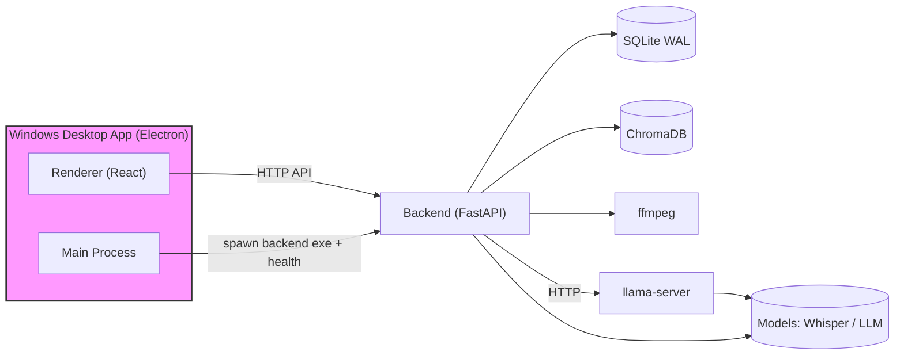

# Edge-AI-Video-Summarizer


本项目是一个 **本地优先（local-first）** 的视频处理与检索后端：

- 导入本地视频
- 抽取音频并进行 ASR 分段转写（支持断点续跑）
- 导出可播放字幕（SRT/VTT）
- 对转写内容进行分块、Embedding、向量索引
- 提供检索（`/search`）与问答（`/chat`）接口：支持 retrieval-only，也支持接入本地 LLM（RAG）

后端基于 **FastAPI + SQLite**，向量库使用 **ChromaDB**。

同时提供 **Electron + Vite + React** 桌面端（Windows），用于本地视频库/详情页/任务进度与结果预览，并在发布态自动托管后端进程。

> 说明：仓库中的 `demo/` 内容用于其他平台（如 ModelScope）展示，因此本 GitHub 仓库默认忽略 `demo/`（见根目录 `.gitignore`）。

---

## 功能概览

### MVP-1：转写与字幕导出

- 本地视频导入与去重入库
- 任务系统（Job）：转写任务、取消、重试、重启恢复
- 转写结果按 JSONL 分段落盘，支持断点续跑
- 字幕导出：`SRT` / `VTT`
- 列表查询：视频列表、任务列表

### MVP-2：文本知识库（Index/Search/Chat）

- Chunking：按时间窗聚合转写 segments，支持 overlap
- Embedding：默认提供本地可用的 `hash` embedding（`384` 维）
- 向量库：ChromaDB 持久化
- Index Job：分块 → embedding → upsert 到向量库
- 搜索：`GET /search`
- 问答：`POST /chat`
  - retrieval-only：返回 `answer + citations`
  - 本地 LLM（RAG）：返回 `answer + citations`，LLM provider 通过 `/llm/preferences/default` 配置
- 索引过期检测：基于 transcript 文件 hash 判断 stale index，并自动触发重建
- Chroma collection 版本化：按 `embed_model + embed_dim` 隔离，避免维度冲突；必要时对 legacy collection 做兼容回退

### MVP-2：本地 LLM（llama-server）

- 支持 `llama.cpp` 的 `llama-server`（OpenAI-compatible `/v1/chat/completions`）
- 后端通过 provider `openai_local` 调用本地 LLM
- 支持非流式与 SSE 流式输出
- 默认 LLM 偏好支持 `output_language`（`zh/en/auto`），用于控制 Chat/摘要/大纲/云摘要输出语言

### MVP-3：层级摘要（Map-Reduce）与大纲结构 + 导出

- 新增 `summarize` job：Map-Reduce 生成分段摘要与最终摘要
- 输出结构化大纲（JSON）与导出 Markdown
- 相关接口：`/videos/{video_id}/summarize`、`/videos/{video_id}/summary`、`/videos/{video_id}/outline`、`/videos/{video_id}/export/markdown`

### MVP-4：关键帧提取（interval / scene）

- 新增 `keyframes` job
- Stage 1（固定间隔抽帧）：`ffmpeg` 抽帧输出 JPG，支持 `target_width`，并写入 SQLite（含 `timestamp_ms`、`width/height`）
- Stage 2（场景切换检测）：`ffmpeg select=gt(scene,thr)` 检测候选帧并写入 `score`
- 与大纲对齐：`/videos/{video_id}/keyframes/aligned`
  - `method=scene`：优先高分帧并支持 `min_gap_seconds` 去重
  - 可选兜底：`fallback=nearest`（章节内不足时按章节中点最近补齐；默认关闭）

### 实时进度推送

- SSE：`GET /jobs/{job_id}/events`
- WebSocket：`GET ws://127.0.0.1:8001/ws/jobs/{job_id}`

---

## 系统架构（简图）



## 目录结构

- `backend/`：FastAPI 后端源码、测试与开发工具配置
- `frontend/`：Electron + Vite + React 桌面端（开发中；已实现视频库/导入/详情页与任务进度预览）
- `scripts/`：PowerShell 自动化验证/质量检查脚本
- `artifacts/`：脚本输出与导出文件（默认忽略）
- `release/`：桌面端打包产物输出目录（默认忽略）
  - `release/stable/<version>/`：正式版产物
  - `release/beta/<version>/`：预发布版产物（版本号包含 `-`）
- `start_dev.cmd`：桌面端开发一键启动（llama-server + backend + Electron 前端）
- `Architecture_Design.md`：架构与里程碑规划
- `PROJECT_STATUS.md`：项目进度、测试备忘、变更记录

---

## 快速开始（Windows / PowerShell）

### 1) 创建虚拟环境并安装依赖

在 `backend/` 目录：

```powershell
python -m venv .venv
.\.venv\Scripts\Activate.ps1

pip install -r requirements.txt
```

如需开发质量工具（flake8/mypy/pyright/pytest）：

```powershell
pip install -r requirements-dev.txt
```

### 2) 启动后端

方式 0（推荐，启动本地栈）：一键启动 llama-server + backend

```powershell
./scripts/run_local_stack.ps1
```

停止本地栈：

```powershell
./scripts/stop_local_stack.ps1 -ForceStop
```

方式 A：直接用 uvicorn

```powershell
python -m uvicorn app.main:app --host 127.0.0.1 --port 8001
```

方式 B：使用脚本（会强制使用 `backend/.venv` 的 python）

```powershell
./scripts/run_backend_dev.ps1
```

### 2.5) 启动桌面端（Electron / 前后端联调）

推荐方式：在仓库根目录直接双击：`start_dev.cmd`

- 默认行为：自动启动 `llama-server` + 后端 + Electron 前端
- 可选：你也可以在 PowerShell 中运行（便于看日志/传参）：

```powershell
./start_dev.cmd
```

停止桌面端：

```powershell
./scripts/stop_dev.ps1 -ForceStop
```

> 说明：llama-server 的状态由后端探测 `LLM_LOCAL_BASE_URL + /models`。如果 Settings 里显示无法连接，优先确认 `http://127.0.0.1:8080/v1/models` 是否可访问，以及查看 `artifacts/logs/llama_server_*.stderr.log`。

### 2.6) 桌面端打包与发布（Windows）

在 `frontend/` 目录：

```powershell
npm run dist
```

- `dist` 会自动执行后端 staging、构建与 electron-builder 打包
- 产物会根据版本号自动分流到：
  - 版本号不包含 `-`：`release/stable/<version>/`
  - 版本号包含 `-`：`release/beta/<version>/`

如需手动指定渠道：

```powershell
npm run dist:stable
npm run dist:beta
```

Windows 文件锁说明：若你曾从 `release/**/win-unpacked` 直接运行过程序，`resources/app.asar` 可能被占用导致删除/覆盖失败。构建脚本已在 `dist/pack` 前自动停止相关进程（见 `scripts/stop_release_apps.ps1`）。必要时可手动运行：

```powershell
powershell -NoProfile -ExecutionPolicy Bypass -File .\scripts\stop_release_apps.ps1
```

桌面端当前已联通的功能：

- 视频库（Library）：视频列表（`GET /videos`）+ 导入（Electron 文件选择器 → `POST /videos/import`）
- 视频详情（Video Detail）：
  - 转写：参数面板 + SSE 进度订阅（`GET /jobs/{job_id}/events`）+ transcript 预览（`GET /videos/{id}/transcript`）
  - 索引/摘要/关键帧：SSE 进度订阅 + 结果预览（index/summary/outline/keyframes）
  - 播放器：
    - 视频播放（`/videos/{video_id}/file`）+ 可播放字幕（VTT track）
    - 控件：`-15s/+15s`、倍速、复制当前时间戳
    - 字幕开关：可关闭/开启“自动生成字幕”（避免与视频自带字幕冲突）
    - 联动：点击转写段落/大纲节点/引用/关键帧可跳转到对应时间戳
  - Notes（摘要/大纲侧栏）：
    - 摘要 markdown 阅读优化（轻量渲染：标题/列表/代码块）+ 展开/收起（按高度折叠）
    - 自动展开大纲开关（进入 Notes 可自动展开并加载）
    - 大纲节点可折叠 + 全部展开/全部收起
    - aligned keyframes：缩略图时间戳 overlay、数量展示、空态与加载态更清晰，并避免重复请求
  - AI 助手（Chat 侧栏）：
    - SSE streaming 输出、取消、confirm_send 确认提示、索引未就绪自动等待并重试
    - 回答支持轻量 markdown 渲染；引用列表更清晰并支持“一键跳转”到视频时间戳
    - 快捷键：Ctrl/Cmd + Enter 发送；支持清空结果
- Settings：
  - 全局 UI 语言切换（中文/English，localStorage 持久化）
  - 默认 LLM 偏好新增 `output_language`（`zh/en/auto`）并持久化到 `/llm/preferences/default`

### 3) 健康检查

```powershell
curl.exe http://127.0.0.1:8001/health
```

---

## 常用接口

- `POST /videos/import`
- `POST /jobs/transcribe`
- `GET /jobs` / `GET /videos`
- `GET /videos/{video_id}/subtitles/srt`
- `GET /videos/{video_id}/subtitles/vtt`
- `POST /videos/{video_id}/index`
- `GET /search?video_id=...&query=...&top_k=...`
- `POST /chat`
- `GET /llm/providers`
- `GET /llm/preferences/default`
- `PUT /llm/preferences/default`
- `POST /videos/{video_id}/summarize`
- `GET /videos/{video_id}/summary`
- `GET /videos/{video_id}/outline`
- `GET /videos/{video_id}/export/markdown`
- `POST /videos/{video_id}/keyframes`
- `GET /videos/{video_id}/keyframes/index`
- `GET /videos/{video_id}/keyframes`
- `GET /videos/{video_id}/keyframes/nearest`
- `GET /videos/{video_id}/keyframes/aligned`
- `GET /videos/{video_id}/keyframes/{keyframe_id}/image`

更完整 API 与 PowerShell 示例见：`PROJECT_STATUS.md`。

---

## 自动化脚本（PowerShell）

- `scripts/index_search_chat_test.ps1`：回归验证 `/index`、`/search`、`/chat`（含 200/202 竞态容忍与 job_id 复用断言）
- `scripts/local_llm_e2e_test.ps1`：端到端验证本地 LLM（llama-server）+ 设置默认 LLM 偏好 + index + `/chat` 非流式与 SSE
- `scripts/run_llama_server.ps1`：一键启动本地 `llama-server`（含 `/v1/models` 健康检查与日志落盘）
- `scripts/run_local_stack.ps1`：一键启动 llama-server + backend，并可选自动运行 `local_llm_e2e_test.ps1`（支持 `-ForceReindex`，并尽量复用已运行服务）
- `scripts/stop_local_stack.ps1`：停止 `run_local_stack.ps1` 启动的进程（读取 `artifacts/*.pid` 与 `artifacts/local_stack_pids.json`）
- `scripts/restart_recovery_test.ps1`：验证重启恢复
- `scripts/cancel_retry_test.ps1`：验证取消/重试
- `scripts/run_quality_checks.ps1`：一键运行 flake8/mypy/pyright/pytest

---

## CI（GitHub Actions）

已接入 GitHub Actions：`.github/workflows/quality.yml`

- flake8
- mypy
- pyright
- pytest

---

## 发布与版本策略（桌面端，维护者）

### 版本与渠道

- `x.y.z`：stable（正式版）
- `x.y.z-...`：beta（预发布版，例如 `0.0.1-beta.1`）
- Git tag：建议使用 `v<version>`（例如 `v0.0.1-beta.1`）

桌面端打包产物输出目录：

- stable：`release/stable/<version>/`
- beta：`release/beta/<version>/`

### 推荐上传的 Release 资产（Windows）

- `Edge Video Agent Setup <version>.exe`
- `Edge Video Agent Setup <version>.exe.blockmap`
- `Edge Video Agent-<version>-win.zip`
- `SHA256SUMS.txt`（推荐）

不建议上传：

- `win-unpacked/`（体积大且在 Windows 上更容易出现文件占用导致删除/覆盖失败）
- `builder-debug.yml` / `builder-effective-config.yaml`

### 生成 SHA256SUMS（PowerShell）

在仓库根目录：

```powershell
$ver = "0.0.1-beta.1"
$dir = "release\beta\$ver"

Get-FileHash -Algorithm SHA256 `
  "$dir\Edge Video Agent Setup $ver.exe", `
  "$dir\Edge Video Agent Setup $ver.exe.blockmap", `
  "$dir\Edge Video Agent-$ver-win.zip" |
  ForEach-Object { "$($_.Hash)  $($_.Path | Split-Path -Leaf)" } |
  Set-Content -Encoding ASCII "$dir\SHA256SUMS.txt"
```

### 创建/上传 GitHub 预发布版（PowerShell）

```powershell
$ver = "0.0.1-beta.1"
$tag = "v$ver"
$dir = "release\beta\$ver"

gh release create $tag `
  "$dir\Edge Video Agent Setup $ver.exe" `
  "$dir\Edge Video Agent Setup $ver.exe.blockmap" `
  "$dir\Edge Video Agent-$ver-win.zip" `
  "$dir\SHA256SUMS.txt" `
  --repo "Caria-Tarnished/Edge-AI-Video-Summarizer" `
  --title "$tag" `
  --notes "Beta prerelease ($tag). Windows installer + portable zip." `
  --prerelease
```

若 release 已存在，改用 `upload`：

```powershell
$ver = "0.0.1-beta.1"
$dir = "release\beta\$ver"

gh release upload "v$ver" `
  "$dir\Edge Video Agent Setup $ver.exe" `
  "$dir\Edge Video Agent Setup $ver.exe.blockmap" `
  "$dir\Edge Video Agent-$ver-win.zip" `
  "$dir\SHA256SUMS.txt" `
  --repo "Caria-Tarnished/Edge-AI-Video-Summarizer" `
  --clobber
```

## 环境变量（部分）

- `EDGE_VIDEO_AGENT_DATA_DIR`：数据目录（SQLite/转写/索引等）
- `EDGE_VIDEO_AGENT_DISABLE_WORKER`：禁用后台 worker（测试用）
- `ENABLE_CLOUD_SUMMARY`：是否允许云摘要（默认关闭）
- `LLM_LOCAL_BASE_URL`：本地 llama-server 的 OpenAI API base url（默认 `http://127.0.0.1:8080/v1`）
- `LLM_LOCAL_MODEL`：本地 llama-server 的默认 model id（默认 `llama`）
- `LLM_REQUEST_TIMEOUT_SECONDS`：后端调用 LLM 的 HTTP 超时（秒），用于非流式请求（默认 `600`）
- `VITE_BACKEND_BASE_URL`：桌面端前端调用后端的 base url（开发期由脚本注入，默认 `http://127.0.0.1:8001`）

更多配置项请参考：`backend/app/settings.py`。

> 补充：LLM 的默认偏好通过 `GET/PUT /llm/preferences/default` 管理（provider/model/temperature/max_tokens/output_language）。

---

## 下一步（建议顺序）

- 完成：桌面端视频库（Library）页（列表 + 导入入口）
- 完成：桌面端视频详情页（转写/索引/摘要/关键帧）与进度展示（SSE）+ 结果预览
- 完成：全局 UI 语言切换（中文/English）与 LLM 输出语言 `output_language`（`zh/en/auto`）全链路生效
- 下一步（建议进入 P3）：
  - Release 工程化：CI 构建 Windows 产物 + 自动创建/上传 GitHub Release（含 SHA256 校验文件）
  - 自动更新策略（可选）：electron-updater / 手动检查更新（二选一）
  - 首次运行向导：whisper 模型/llama-server/本地模型的可用性检查与下载指引
  - 数据目录：选择/迁移/备份策略（避免升级覆盖与用户数据丢失）
  - 播放器增强（可选）：键盘快捷键、章节导航、画中画/全屏体验优化
  - 任务中心（可选）：全局 jobs 列表 + 取消/重试 + 进度订阅

---

## 许可证

如需添加 License 或贡献指南（CONTRIBUTING），可以在后续补齐。
